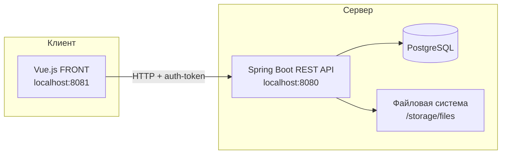
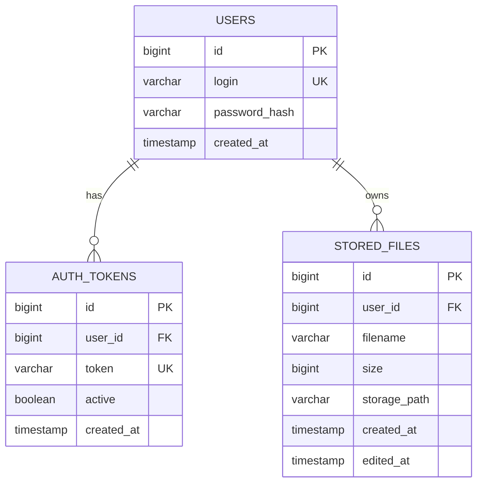
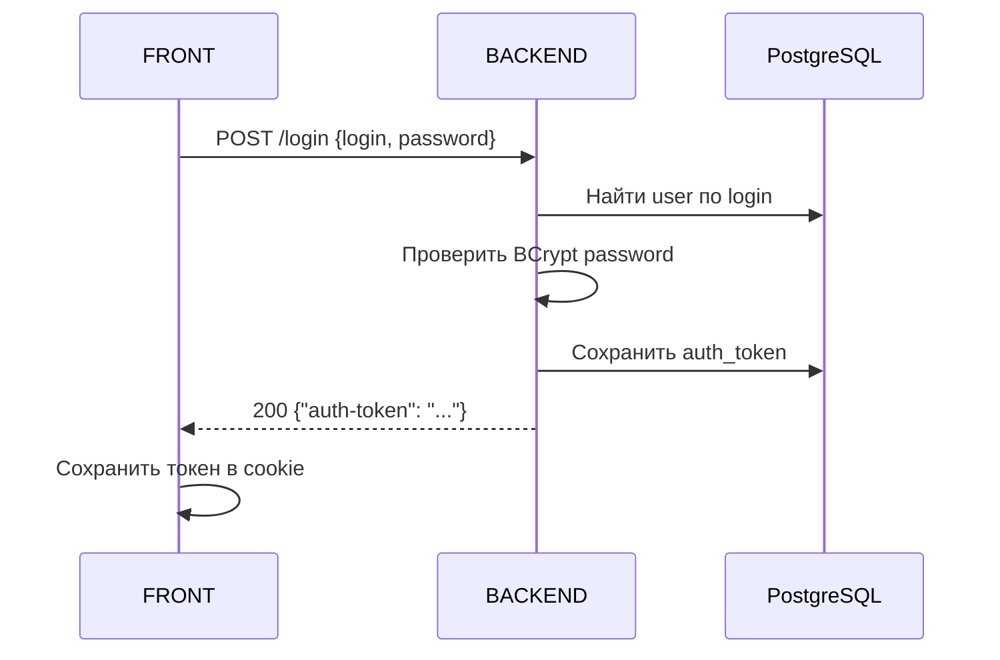
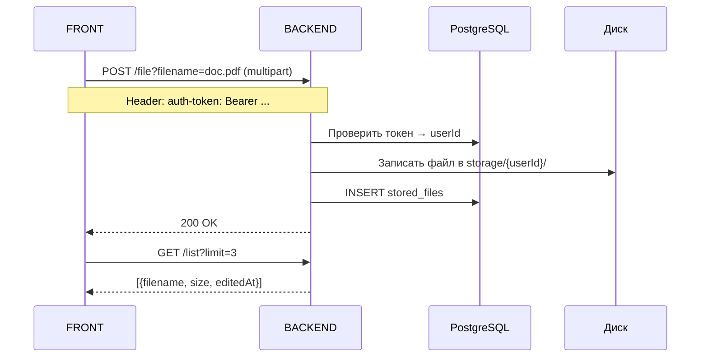

# Архитектура облачного хранилища

## Обзор системы



---

## Компоненты

### 1. FRONT (Vue.js 3 + TypeScript)

- Расположение: `Docs/cloud-service/netology-diplom-frontend/`
- Не модифицируется — используется как есть для проверки интеграции
- Отвечает за UI: логин, список файлов, загрузка, скачивание, переименование, удаление

### 2. BACKEND (Spring Boot)

- Расположение: `cloud-service-backend/` (будет создан на этапе реализации)
- REST API по спецификации
- Авторизация по токену в заголовке `auth-token`
- Бизнес-логика в сервисном слое

### 3. PostgreSQL

- Хранение пользователей, токенов, метаданных файлов
- Запуск через docker-compose

### 4. Файловое хранилище

- Бинарные данные файлов — на диске (не в БД)
- Путь настраивается в `application.yml`: `storage.files.path`
- Структура: `{storagePath}/{userId}/{filename}`

---

## Слои backend-приложения

```
Controller  →  Service  →  Repository
     ↓              ↓
  DTO/Response   FileStorage (диск)
```

| Слой | Ответственность |
|------|-----------------|
| `controller` | HTTP-эндпоинты, маппинг запросов/ответов |
| `service` | Бизнес-логика: auth, CRUD файлов |
| `repository` | JPA-доступ к PostgreSQL |
| `config` | CORS, Security, Multipart, properties |
| `security` | Фильтр проверки `auth-token` |
| `exception` | Глобальная обработка ошибок |

---

## Схема базы данных



### Таблица `users`

| Колонка | Тип | Описание |
|---------|-----|----------|
| id | BIGSERIAL PK | Идентификатор |
| login | VARCHAR(255) UNIQUE | Логин (email) |
| password_hash | VARCHAR(255) | BCrypt-хеш пароля |
| created_at | TIMESTAMP | Дата создания |

### Таблица `auth_tokens`

| Колонка | Тип | Описание |
|---------|-----|----------|
| id | BIGSERIAL PK | Идентификатор |
| user_id | BIGINT FK → users | Владелец токена |
| token | VARCHAR(255) UNIQUE | Значение токена |
| active | BOOLEAN | Активен ли токен |
| created_at | TIMESTAMP | Дата выдачи |

### Таблица `stored_files`

| Колонка | Тип | Описание |
|---------|-----|----------|
| id | BIGSERIAL PK | Идентификатор |
| user_id | BIGINT FK → users | Владелец файла |
| filename | VARCHAR(500) | Имя файла |
| size | BIGINT | Размер в байтах |
| storage_path | VARCHAR(1000) | Путь на диске |
| created_at | TIMESTAMP | Дата загрузки |
| edited_at | TIMESTAMP | Дата последнего изменения |

---

## Конфигурация (`application.yml`)

```yaml
server:
  port: 8080

spring:
  datasource:
    url: jdbc:postgresql://localhost:5432/cloudstorage
    username: cloud
    password: cloud
  jpa:
    hibernate:
      ddl-auto: validate
  servlet:
    multipart:
      max-file-size: 100MB
      max-request-size: 100MB

storage:
  files:
    path: ./storage/files

cors:
  allowed-origins: http://localhost:8081
```

> Все изменяемые параметры — только в yml, без хардкода в коде.

---

## Потоки данных

### Авторизация



### Загрузка файла



---

## Docker-окружение

```yaml
services:
  postgres:
    image: postgres:16-alpine
    ports: ["5432:5432"]
    environment:
      POSTGRES_DB: cloudstorage
      POSTGRES_USER: cloud
      POSTGRES_PASSWORD: cloud

  backend:
    build: ./cloud-service-backend
    ports: ["8080:8080"]
    depends_on: [postgres]
    volumes:
      - file-storage:/app/storage/files
```

FRONT запускается отдельно на хосте (`npm run serve` в папке frontend).

---

## Технологический стек

| Компонент | Технология |
|-----------|------------|
| Backend | Java 17+, Spring Boot 3.x |
| Сборка | Gradle (Kotlin DSL) |
| БД | PostgreSQL 16 |
| ORM | Spring Data JPA |
| Миграции | Flyway |
| Тесты (unit) | JUnit 5 + Mockito |
| Тесты (integration) | Testcontainers |
| Контейнеризация | Docker + docker-compose |
| FRONT | Vue.js 3 (исходники от Нетологии) |
